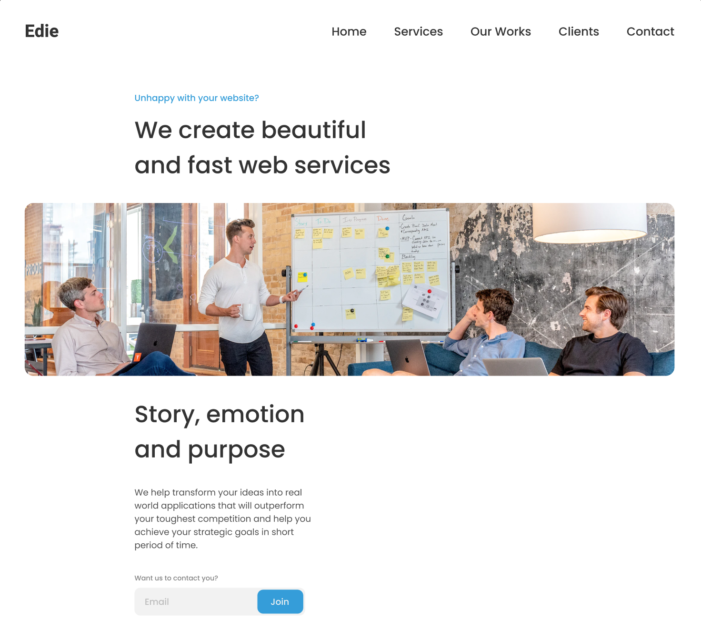

# Edie Homepage

Challenge: Create a static page with HTML and CSS following the designs. Don’t look at the existing solution. Fulfill user stories below:


This image is just a preview, the full design is on the figma file!

-   User story: I can see a page following the given design
-   User story: I can see a page on mobile following the given design
-   User story: I can go to certain locations by selecting links in navigation or footer

**Icon**: https://google.github.io/material-design-icons/

**Design** : https://www.figma.com/file/ahnGupP4JjTdVJDTRfMRF2

Surprise me with mobile navigation!!!

Once you completed, submit your solutions by providing URLs for both GitHub repository and live app on Netlify and explain briefly what you have done.

For the custom domain url you'll enter in netlify, please use the following naming convention : **edie-homepage-_YOUR_FIRSTNAME_.netlify.app** (replace YOUR_FIRSTNAME by your firstname)

Good luck everybody!

Template for your readme :

<!-- Please update value in the {}  -->

<h1 align="center">{Your project name}</h1>

<div align="center">
  <h3>
    <a href="https://{your-demo-link.your-domain}">
      Demo
    </a>
    <span> | </span>
    <a href="https://{your-url-to-the-solution}">
      Solution
    </a>
  </h3>
</div>

<!-- TABLE OF CONTENTS -->

## Table of Contents

-   [Overview](#overview)
    -   [Built With](#built-with)
-   [Features](#features)
-   [How to use](#how-to-use)
-   [Contact](#contact)
-   [Acknowledgements](#acknowledgements)

<!-- OVERVIEW -->

## Overview


Introduce your projects by taking a screenshot or a gif. Try to tell visitors a story about your project by answering:

-   Where can I see your demo?
-   What was your experience?
-   What have you learned/improved?
-   Your wisdom? :)

### Built With

<!-- This section should list any major frameworks that you built your project using. Here are a few examples.-->

-   [React](https://reactjs.org/)

## Features

<!-- List the features of your application or follow the template. Don't share the figma file here :) -->

## How To Use

<!-- Example: -->

To clone and run this application, you'll need [Git](https://git-scm.com) and [Node.js](https://nodejs.org/en/download/) (which comes with [npm](http://npmjs.com)) installed on your computer. From your command line:

```bash
# Clone this repository
$ git clone https://github.com/your-user-name/your-project-name

# Install dependencies
$ npm install

# Run the app
$ npm start
```

## Acknowledgements

<!-- This section should list any articles or add-ons/plugins that helps you to complete the project. This is optional but it will help you in the future. For example: -->

## Contact

-   Website [your-website.com](https://{your-web-site-link})
-   GitHub [@your-username](https://{github.com/your-usermame})
-   Twitter [@your-twitter](https://{twitter.com/your-username})
